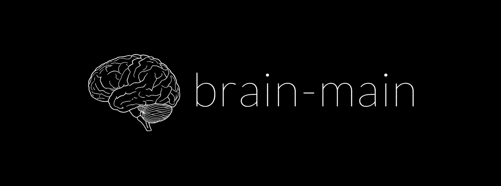

# brain

brain is an experiment in building an artificial "brain" composed of small,
cooperating services. Each service emulates a specific brain region and operates
on continuous embeddings rather than text tokens. The project is still in development.

The high level layout mirrors how sensory information flows through the human
brain. Sensors capture raw data which is encoded, routed through early sensory
processors, integrated across associative regions, and finally used to produce
motor output. A trainer process performs online adapter updates to keep the
system plastic.

```
brain/
├── configs/                  # hyperparameters and paths
├── models/                   # offline model checkpoints
│   └── model_initialization_scripts/
├── persistent/              # snapshots of memory and adapter weights
├── scripts/                  # launchers for each brain region service
└── src/                      # implementation of each region
```

## Defining AGI

Within this project we use the term **AGI** to describe a synthetic mind that
behaves in the same fashion as a human brain. The emphasis is on reproducing
human-like perception, memory and decision making rather than maximizing scores
on intelligence benchmarks.

Because of this behavioural focus, raw measures of intellect such as IQ do not
determine whether something counts as AGI. Just as we regard people
independently of their test results, an artificial agent may qualify as AGI
even if its measured intelligence varies widely.

## Neural vs. Neuronal topologies

Neuronal topologies are essentially a vector field. From person to person they vary greatly on the neuron level, but on the whole (neural level) they tend to move around in a similar fashion, with the same branching characteristics, etc.

Collapsing similar vectors yields a general neural topology.

Then, you can orchestrate entire digital brains with 10-100+ vectors, and give them dimensionality ensuring that they are compatible from one to the next, or in conjunction. 

NEAT algorithms could be powerful, but that's not a small risk, by any means, and should be handled with excrutiating care and regard.

NOTE: The current output of brain-main is to the motor cortex. This is a poor mapping, as this is a lossy mapping in humans, and is set to a 'neuron-per-token' output model as of now. Future versions will distance the token outputs in space, such that the lossy nature can be preserved, although this is not straightforward given the multiplicity of token semantics mappings.

## Getting Started

1. **Install Dependencies**

   ```bash
   python -m venv .venv
   source .venv/bin/activate
   pip install -r requirements.txt
   sudo apt-get install -y espeak-ng
   ```

2. **Download Base Models**

   Run the helper script to fetch all Hugging Face checkpoints into the
   `models/` directory. This only needs to be done once.

   ```bash
   python brain/models/model_initialization_scripts/download_models.py
   ```

The script downloads the following models sequentially:

   - `openai/clip-vit-base-patch32`
   - `openai/whisper-small`
   - `gpt2`
   - `bert-base-uncased`

3. **Precompute Token Embeddings**

   Generate a lookup table of token embeddings used by the language areas. The
   output is written to ``brain/persistent/token_embeddings.npy``.  If the
   ``recalculate_lookup_tables`` option in ``configs/default.yaml`` is set to
   ``true`` the table will be rebuilt automatically when the brain starts.

   ```bash
   python brain/src/utils/token_table.py
   ```

4. **Generate Valence Embeddings**

   Create a small table of positive, negative, affection and incorrect phrases
   used when assessing emotional valence. The resulting file is
   ``brain/persistent/valence.npy``.  Like the token table, this can also be
   regenerated automatically at start-up when
   ``recalculate_lookup_tables`` is enabled.

   ```bash
   python brain/src/utils/valence_table.py
   ```

5. **Run the Brain**

   Execute the main integration loop from the repository root (the
   directory containing the ``brain`` folder). This command launches
   the brain and starts a small PyGame viewer window while also printing
   the motor cortex output.  The window updates continuously until you
   interrupt the program with ``Ctrl+C``:

  ```bash
  python -m brain.src.brain
  ```

  Pass ``--gui_train`` to launch the PyGame training interface which expands
  the viewer window with a scrollable log of motor cortex messages,
  colour‑coded rating buttons and a text input box. Only warnings
  and errors are printed to the terminal in this mode.

   Alternatively, you can run `./scripts/run_brain.sh` which performs the
   same action with the proper `PYTHONPATH` configured.

### Symbolic Embedding Pipeline

To keep the system on a purely semantic level, models are "decapitated"
so that only continuous embeddings are passed between brain regions. The
`WernickesArea` class in `src/language_areas/wernickes_area.py` wraps the
front half of GPT-2 by default and exposes hidden-state embeddings without the
language modeling head.  Alternatively, you can enable the
`bert-base-uncased` model in `configs/default.yaml` to
experiment with a different encoder. Text is tokenized only transiently
during encoding and is immediately discarded.

Similarly, the `Retina` class in `src/sensors/retina.py` uses the vision
branch of CLIP to convert raw images into 512-dimensional embeddings. No
classification logits or text tokens are produced, so pixel data is
discarded after encoding. The resulting vectors can be further processed
by `OccipitalLobe` (`src/occipital_lobe.py`) which reduces them to
compact 128-dimensional visual features.

## Development Notes

Each brain region in `src/` will ultimately run as its own service. The scripts
in `scripts/` are placeholders for launching these processes. The
communication layer and live-training dynamics are
outlined in `neurosymbolic_plan.md`.

### Running brain

Running ``python -m brain.src.brain`` starts the full integration
loop, loading the decapitated models, fusing a dummy image with text and
printing the motor cortex output. A viewer window powered by ``pygame``
displays the live camera feed with an audio level meter and text overlay.
Press ``Ctrl+C`` to stop the brain.
Click the **Treat** button at the bottom of the viewer to give positive feedback
and boost dopamine levels. Spoken feedback is also matched against the valence
phrases so saying "good job" raises dopamine, while phrases like "that's
incorrect" boost norepinephrine and now reduce dopamine proportionally. The
viewer overlays the current hormone levels in the top left corner so changes are
visible in real time.

The ``settings`` section of ``configs/default.yaml`` now includes
``motor_candidates`` which controls how many speculative tokens the motor
cortex generates each step. Increasing this value trains on multiple
possible outputs while only printing the highest-probability token.
Motor output timing is now governed by a ``SupplementaryMotorArea`` that mixes
signals from the premotor cortex, inferior frontal gyrus and prefrontal cortex.
Its adaptive threshold ramps up over a configurable duration instead of using the
previous fixed ``motor_pause_seconds`` delay.
The ramp length is controlled by ``action_threshold_ramp_duration`` which
defaults to ``60`` seconds and can be adjusted in ``configs/default.yaml``.
When ``enable_action_threshold_ramping`` is ``false`` the gating threshold is
fixed to ``action_threshold_baseline`` (default ``0.75``).
The ``embedding_model`` option at the top of the file chooses which
text encoder to use (``1`` for GPT-2, ``2`` for the BERT model).
``hippocampus_shards`` sets the total number of memory shards to use while
``cerebral_hemispheres`` chooses how many hippocampal hemispheres are active
(each additional hemisphere behaves like a right hemisphere so language regions
are not duplicated). ``hippocampus_independent`` determines whether each shard
stores unique episodes or mirrors the same data.
``neurogenesis`` can also be enabled to automatically seed blank region
weights using Kaiming initialization whenever no trained parameters are
found. This option is primarily useful the first time you run brain or
after deleting the ``persistent/`` directory. Once weights have been
initialized, leaving ``neurogenesis`` enabled is harmless&mdash;it will only
affect regions whose checkpoint files are missing or contain all zeros.
If you prefer, you can disable the flag after the initial launch and
restart brain normally.

Negative ratings in the training GUI now also feed into the Inferior
Frontal gyrus.  The ``ifg_feedback_buffer`` option determines how long
recent motor outputs remain eligible for inhibition learning (default
``30`` seconds).  Setting it higher allows stronger associations while a
lower value forgets feedback more quickly.

When ``gpu_debug`` is set ``true`` the brain logs the memory footprint of
each major model to ``logs/GPU_debug.log`` during startup. This helps
identify which components consume the most VRAM on multi‑GPU systems.
When ``model_timing_debug`` is ``true`` brain records the time spent in
each brain region's inference step to ``logs/model_timing_debug.log``. This
can be used to spot slow components during development.
``serotonin_baseline`` sets the target serotonin level for hormonal
homeostasis (default ``0.5``) so recovery accelerates when levels drift.
``dopamine_baseline`` performs the same role for dopamine so levels quickly
return toward ``0.5`` when no reinforcement is present.
Norepinephrine and acetylcholine now also decay slowly toward zero each
step to avoid runaway activation.

The motor cortex now predicts the likely valence of each speculative
token using hippocampal recall and the amygdala before choosing which
one to emit. When a predicted outcome appears favourable the
``HypothalamusPituitaryAxis`` receives a small dopamine boost which makes
execution of that token more likely.

All learned memories and adapter weights are automatically written to the
``brain/persistent/`` directory so progress can be resumed on the next
launch. Each LoRA adapter is saved to its own ``<region>_<adapter>.pt`` file
alongside the main checkpoint so updates are never lost. Removing that
directory resets the brain back to its initial state. You can also run
``python -m brain.src.utils.memory_wipe`` to delete any saved snapshots
in the ``brain/persistent/`` folder and clear accumulated log files.
If the ``recalculate_lookup_tables`` setting is enabled this command will
also remove the ``token_embeddings.npy`` and ``valence.npy`` lookup tables
so they are rebuilt on the next run.

## License

This project is distributed under the terms of LICENSE. See the [LICENSE](LICENSE) file for the full text. By using or distributing brain, you agree to uphold the terms of use.

